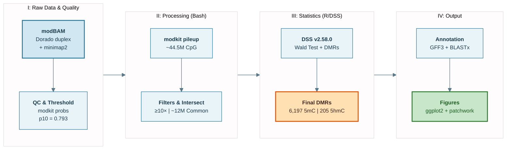
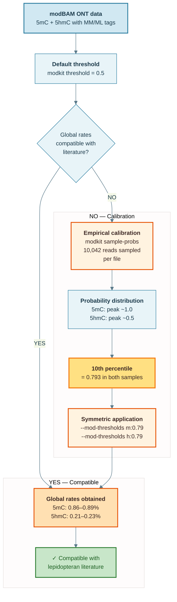
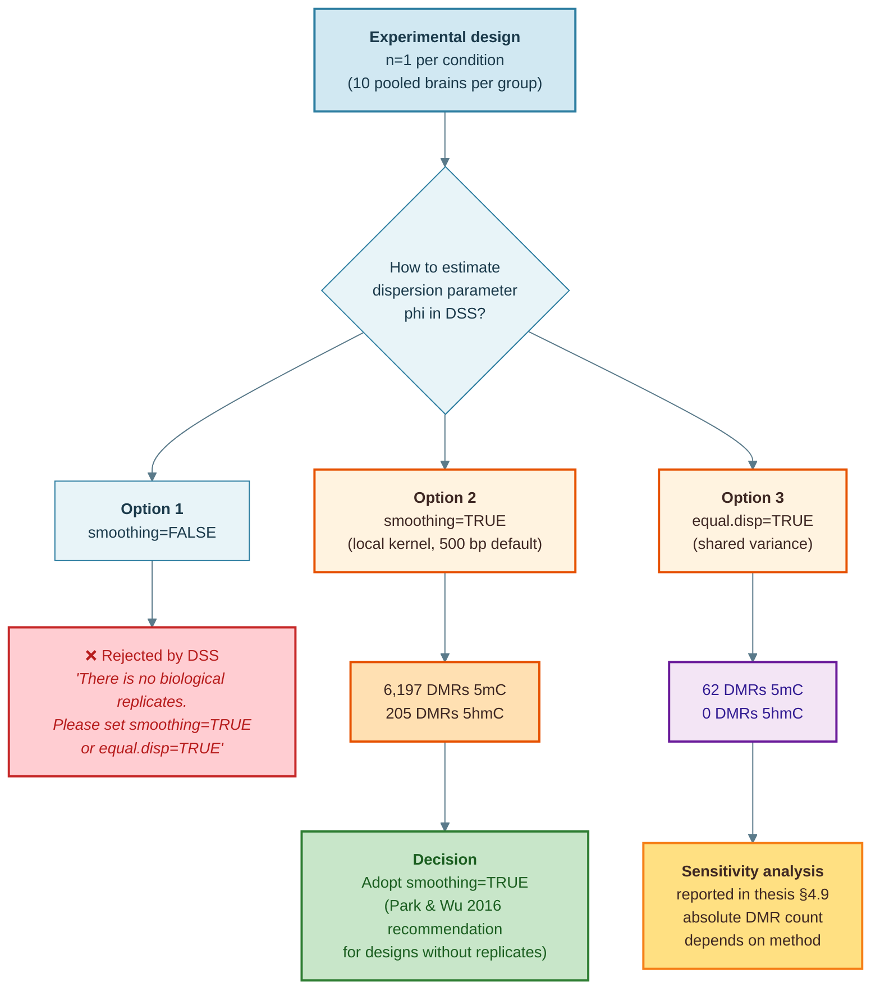
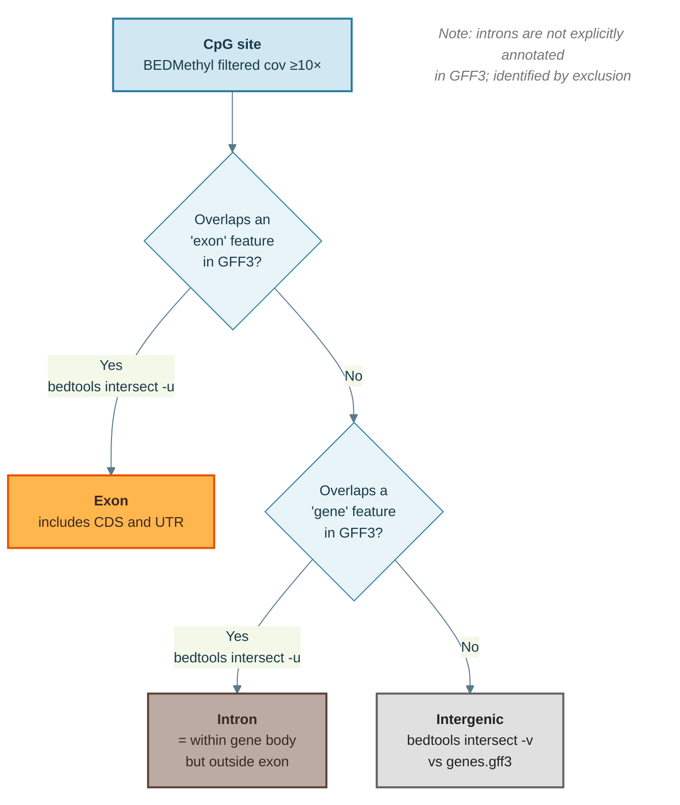

# ONT Methylation Pipeline for *Heliconius erato lativitta*

[](https://opensource.org/licenses/MIT)
[](https://orcid.org/0009-0008-7799-9525)
[](https://zenodo.org/badge/latestdoi/1234355389)

Reproducible workflow for simultaneous detection of 5-methylcytosine (5mC) and
5-hydroxymethylcytosine (5hmC) in insect brain tissue using Oxford Nanopore
Technology (ONT). The pipeline processes modBAM files from Dorado duplex basecalling
through empirical threshold calibration, coverage filtering, and beta-binomial DMR
detection via DSS.

Designed for non-model Lepidoptera with no prior methylome characterization.
Validated on *Heliconius erato lativitta* central brain tissue (20 individuals,
~44.5M CpG sites, 33–52x genome-wide coverage).

---

## Technical Specifications

| Tool | Version | Role |
|---|---|---|
| Dorado | duplex mode | Basecalling and modification detection |
| modkit | 0.5.0 | modBAM pileup and empirical threshold calibration |
| minimap2 | 2.24 | Alignment to reference genome |
| samtools | 1.16.1 | BAM file handling |
| bedtools | 2.30.0 | Genomic arithmetic and intersect operations |
| DSS | 2.58.0 (Bioconductor) | Beta-binomial DMR detection |
| R | 4.2.2 | Statistical analysis and visualization |

---

## Pipeline Overview

Full workflow: Dorado duplex basecalling → modkit pileup → coverage filtering →
bedtools intersect → DSS → CAT GFF3 annotation → candidate genes.



---

## Methodological Decisions

Each non-default analytical choice is documented with a decision diagram to ensure
transparency and reproducibility.

### Probability Threshold Calibration

The modkit default threshold (0.5) was not applied directly. An empirical calibration
was performed using `modkit sample-probs` (10,042 reads sampled per file). The 10th
percentile of the resulting probability distribution (p10 = 0.793) was used as a
symmetric threshold for both modifications, yielding global rates consistent with
reported lepidopteran baselines.



### Dispersion Estimation in DSS

Three options were evaluated for dispersion parameter estimation under a pooled
design (n = 1 per condition). `smoothing = FALSE` was rejected by DSS at runtime.
`smoothing = TRUE` (Park & Wu, 2016) was selected based on software recommendation
and is the established approach for designs without biological replicates. A
sensitivity analysis with `equal.disp = TRUE` is documented in the thesis (§4.9).



### Genomic Context Classification

CpG sites were classified through hierarchical intersections with the
`Hlat.v1.1.CAT.gff3` annotation file. Introns are not explicitly annotated in GFF3
and are identified by exclusion (gene body regions minus annotated exons).



---

## Installation & Usage

**1. Recreate the environment**

```bash
mamba env create -f bioinfo.yml
conda activate bioinfo
```

**2. Configure paths**

Edit `scripts/bash/config.sh` with your local paths:

```bash
# Required inputs
GENOME="/path/to/Hlat.v1.1.fasta"
MODBAM_DIR="/path/to/modbam/files/"
GFF3="/path/to/Hlat.v1.1.CAT.gff3"
OUTDIR="/path/to/output/"
```

**3. Run the pipeline**

```bash
bash scripts/bash/run_pipeline_core.sh
```

The pipeline runs in four sequential stages. Intermediate files are written to
`$OUTDIR` at each stage. The final DMR tables and annotated gene lists are generated
by the R scripts in `scripts/R/`.

**Computational requirements**

Tested on Ubuntu 22.04 with 32 GB RAM and 16 cores. The modkit pileup step is the
most resource-intensive (~6 h per sample at 40x coverage). DSS analysis runs in R
with ~8 GB RAM for ~12M sites.

---

## Repository Structure

```
tfm/
├── scripts/
│   ├── bash/
│   │   ├── config.sh               # Path configuration (edit before running)
│   │   ├── modkit_pileup.sh        # Dual 5mC/5hmC pileup from modBAM
│   │   ├── filter_coverage.sh      # Depth and probability filtering
│   │   ├── prepare_dss_input.sh    # Format conversion to (chr, pos, N, X)
│   │   └── run_pipeline_core.sh    # Main pipeline orchestrator
│   └── R/
│       ├── dss_analysis.R          # DML and DMR detection (DSS)
│       ├── genomic_context.R       # Functional annotation and classification
│       └── dmr_visualization.R     # Methylation profiles for candidate genes
├── assets/
│   └── figures/                    # Decision diagrams (source .mmd files)
├── bioinfo.yml                     # Conda environment specification
├── CITATION.cff                    # Machine-readable citation metadata
└── LICENSE                         # MIT
```

---

## Case Study: *H. erato lativitta* + RG108

The pipeline was validated on the following experimental system.

**Experimental design**

| Parameter | Detail |
|---|---|
| Species | *Heliconius erato lativitta* |
| Individuals | 20 total: 10 control, 10 experimental (5 males + 5 females each) |
| Source | Ikiam insectary, Tena, Ecuador |
| Treatment | RG108: 2 mM topical (2x/day) + 3 mM dietary, 7 days |
| Control | Vehicle: PBS + 1% DMSO |
| Tissue | Central brain (optical lobes excluded) |
| Sequencing | Oxford Nanopore Technology (ONT), duplex mode |
| Reference genome | *H. erato lativitta* v1.1 (CAT annotation) |

**Results summary**

| Modification | Baseline sites | Baseline rate | DMRs under RG108 | Change |
|---|---|---|---|---|
| 5mC | 8,431 | 0.228% | 6,197 | -6.48% |
| 5hmC | 32,843 | 0.888% | 205 | -3.26% |

Methylation is concentrated in exons (~17-fold enrichment over intergenic regions).
Top candidate genes: *pak*, *sin3a*, *drp1* (synaptic plasticity and epigenetic
regulatory machinery). This constitutes the first simultaneous 5mC and 5hmC
characterization in *Heliconius* brain tissue.

**Associated manuscript**

Ojeda A, Marín P, Bacquet C (in preparation). Brain methylome of *Heliconius erato
lativitta* via Oxford Nanopore Technology: first simultaneous 5mC and 5hmC atlas.

---

## Data Availability

Raw sequencing data will be deposited in the European Nucleotide Archive (ENA) upon
manuscript submission. The reference genome (*H. erato lativitta* v1.1) is available
from [Lepbase](http://lepbase.org).

---

## Citation

If you use this pipeline, please cite this repository:

```
Ojeda A (2026). ONT Methylation Pipeline for Heliconius erato lativitta.
GitHub: https://github.com/AngelOjedaBioinfo/tfm
DOI: [Zenodo DOI — assigned at v1.0.0 release]
```

A `CITATION.cff` file is included for automated citation tools (GitHub, Zotero,
Mendeley).

---

## Authors & Acknowledgments

**Ángel Andrés Ojeda Montesdeoca**
[ORCID 0009-0008-7799-9525](https://orcid.org/0009-0008-7799-9525) |
[GitHub @AngelOjedaBioinfo](https://github.com/AngelOjedaBioinfo)
Laboratorio de Biología Molecular de Docencia (LBMD),
Universidad Regional Amazónica Ikiam, Tena, Ecuador.

**Supervisors:**
Pablo Marín, PhD (Universidad Internacional de Valencia, VIU) |
Caroline Bacquet, PhD (Ikiam / Jiggins Group, Cambridge–Sanger Institute)
